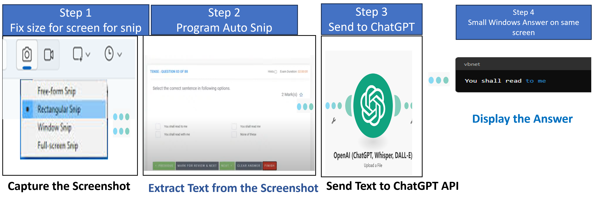

# ExamProctorGPT - HOW TO CHEAT ON AN ONLINE PROCTORED EXAM!! 2024 AUTO GPT AGENT 


ExamProctorGPT is a sophisticated automated system designed to assist in bypassing online proctoring during exams in 2024. Utilizing advanced technologies such as automated screenshot capturing, text extraction with OCR, and intelligent response generation via the ChatGPT API, this tool aims to streamline the process of cheating by providing seamless, efficient, and undetectable solutions.




## Features

- **Dual Camera Monitoring:** Utilizes both front and back cameras to ensure comprehensive monitoring without the user being aware of the camera operation.
- **Automated Screenshot Capture:** Periodically takes screenshots during the exam to capture relevant information.
- **OCR Integration:** Extracts text from screenshots using advanced OCR technology.
- **ChatGPT Response Generation:** Uses the extracted text to generate accurate and context-aware responses through the ChatGPT API.
- **Seamless Integration:** Designed to integrate smoothly with existing online exam platforms.

## How It Works

1. **Screenshot Capture:** The system takes periodic screenshots from the camera feeds without notifying the user.
2. **Text Extraction:** OCR processes the screenshots to extract text content.
3. **Response Generation:** Extracted text is sent to the ChatGPT API, which generates appropriate responses.
4. **Output:** Responses are displayed or sent to the designated interface for review.

## Getting Started

# Screenshot to ChatGPT

This project automates the process of taking a screenshot, extracting text from it using OCR, and generating a response using the ChatGPT API.

## Requirements

- Python 3.x
- PyAutoGUI
- Pillow
- pytesseract
- openai
- OpenCV
- Tesseract OCR
- ChatGPT API key

## Installation

1. Clone the repository:
   ```bash
   git clone https://github.com/raja21068/ExamProctorGPT.git
   cd ExamProctorGPT```
   
   
2. Install the required packages:
pip install pyautogui Pillow pytesseract openai
Ensure Tesseract is installed and configured on your system.
Replace 'your-api-key' in screenshot_to_chatgpt.py with your OpenAI API key.

3. Run the script:
python screenshot_to_chatgpt.py

##  Additional Resources
For more information on a similar project, visit the following GitHub repository:
AI Desktop Assistant - Agent Based Smart Automation Task Management Platform: https://github.com/raja21068/AI-Desktop-Assistant-Agent-Based-Smart-Automation-Task-Management-Platform--chatgpt-4


How to Cheat on an online exam 2024,
How to Cheat on an online proctored exam 2024,
How to Cheat on a proctored exam 2024,
Cheating hacks 2024,
Cheating hacks on an exam 2024,
How to Cheat on Proctorio 2024,
How to Cheat During Browser lockdown,
LOCKDOWN BROWSER HACK 2024,
How to Bypass Exam Proctoring,
How to Bypass Exam Proctoring 2024,


